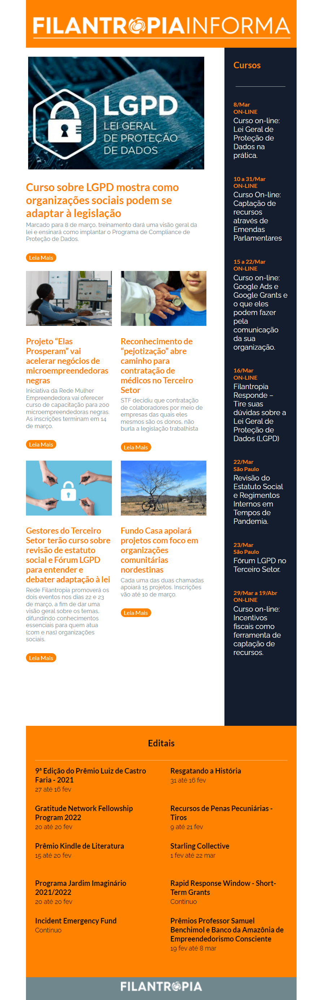

# Newsletter para email HTML

Projeto desenvolvido usando MJML, um framework HTML para emails

Desenvolvimento de Email Marketing CSS e MJML (Framework HTML) para empresa NAKONTA.

[Tutorial de como começar um projeto em MJML](https://www.youtube.com/watch?v=Q1M4tKmBM7k). 

## Detalhes do projeto
* O Layout deve ter 600px de largura
* Responsivo - A ferramenta MJML facilita o desenvolvimento da parte responsiva do projeto desktop/mobile
    * Neste projeto em especifico, foi necessário fazer alguns ajustes de alguns elementos para que ficasse responsivo dentro das normas de Design e de acordo com template desejado.
    ~~~~MJML
    <mj-style>
      @media(min-width: 480px) {
        .desktop {
           padding: 0 40px 0 0 !important;
        }
        ...
      }
    </mj-style>
    ~~~~
* CSS Inline
    * A maioria do código foi desenvolvido no arquinvo index.mjml com CSS Inline em grande parte.
    * Pode converter o código do projeto com CSS Interno para CSS Inline neste [site](https://putsmail.com/). Também para testar
        * O site só aceita em HTML então é necessário converter o MJML para HTML, tem um [tutorial de como começar um projeto em MJML](https://www.youtube.com/watch?v=Q1M4tKmBM7k)

* As referencias para imagens deve ser com links absolutos. Usar links relativos pode resultar em falhas.
* Projeto finalizado com algumas alterações em no arquivo index.html
    * O MJML é como um bootstrap, as vezes é necessário fazer algumas alterações no arquivo index.html para que tenha um bom resultado, principalmente para o aplicativo Outlook do windows, que pode desconfigurar o template.

Os projetos html para email deve ser feito utilizando tabelas.

## Testando
* Copie todo o código do arquivo [index.html](https://github.com/Drlazinho/mjml-newsletter-filantropo/blob/master/index.mjml)
* Registra o seu email nesse [site](https://putsmail.com/).
* No menu superior do site, selecione  new test. Adicione o seu email que quer receber com qualquer título ou descrição
* Cole o código html na área indicada e marque a caixinha para converter o código em CSS Inline.
    * ***Na primeira vez pode exigir a verificação do seu email, sendo necessário realizar novamente os passos de enviar o código html***

## Resultado

## 🤝 Colaboradores

<table>
  <tr>
    <td align="center">
      <a href="#">
         
        
          <b>Lázaro Pimentel</b>
        
      </a>
    </td>
  </tr>
</table>

## Licença
The MIT License (MIT)

Copyright ©️ 2022 - Lázaro Pimentel